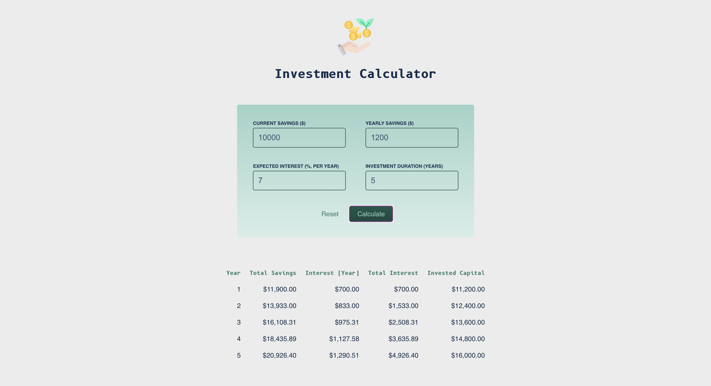

# Investment Calculator

This is a simple investment calculator built with React. Users are able to enter their current savings, yearly additional savings, expected return, and duration of investment. A tabulation of the estimated growth of invested capital will be displayed.

It is my first React mini-project where I practiced fundamentals such as JSX, event handling, state management, lifting the state up, and conditional rendering. This project is part of the requirements for a [React Udemy course](https://www.udemy.com/course/react-the-complete-guide-incl-redux/).

Live Site URL: [https://amsandiego.github.io/investment-calculator](https://amsandiego.github.io/investment-calculator)

## Table of contents

- [Overview](#overview)
  - [Screenshot](#screenshot)
- [My process](#my-process)
  - [Built with](#built-with)
  - [What I learned](#what-i-learned)
  - [Continued development](#continued-development)
  - [Useful resources](#useful-resources)
- [Author](#author)

## Overview

### Screenshot

## My process

### Built with

- React
- CSS Modules

### Flow of Implementation

- First, the project skeleton was setup with create-react-app. Initial codes for interest calculations and JSX code for the overall UI were added to App.js. Initial styles were also added to a global index.css file.
- As the entire code flow is in App.js, the next step is to split the app into multiple components: a header component, form component, and table component.
- Next is handling of events. There are 3 event handlers needed: one for form submission, one for form reset, and the last for listening to input changes by the user.
- State management comes next. For this, the 'useState' hook was used to manage an object state variable to track user input.
- The user input data from Form Component needs to be shared to the Table Component. Thus, we need to lift the shared state up to their closest ancestor (App.js in this case). This is done by passing a handler function from the parent to the child component that accepts an argument which is the data from the child component.
- After lifting the state up, the data can be shared to the sibling component (Table in this case) via props.
- Conditional rendering was used so that there is a fallback message in case there is no user input.
- Lastly, CSS modules are implemented so that the styles are locally scoped.

### Useful resources

- [Deploying a React App to GitHub Pages](https://internetingishard.netlify.app/html-and-css/forms/index.html)
